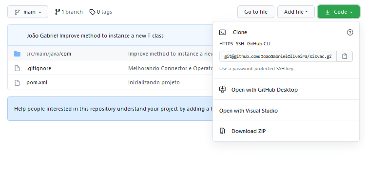

# Projeto de A3

# Como baixar o projeto


- Clique no botão **Code**

- Clique na ultima opção **Download ZIP**


# Como fazer um CRUD com o Service

## Listar todos dados de uma tabela
### SELECT * FROM tabela;
```
    Service<Paciente> service = new Service(Paciente.class);

    List<Paciente> modelos = service.list();
```

## Encontrar um dado de uma tabela pelo ID
SELECT * FROM tabela WHERE id = 1;
```java
    Service<Paciente> service = new Service(Paciente.class);

    Paciente paciente = service.find(1);
```

### Adicionar um novo dado a tabela
INSERT INTO (nome, endereco, etc) paciente VALUES ("Nome do paciente", "Endereco", "etc");
```java
    Service<Paciente> service = new Service(Paciente.class);

    service.create("Nome do paciente", "Endereco", "etc");
```

### Atualizar um dado a tabela
UPDATE paciente SET nome = "Novo nome do paciente";
```java
    Service<Paciente> service = new Service(Paciente.class);

    int Id_do_paciente = 1;

    service.update(Id_do_paciente, "Nome do paciente");
```

### Deletar um dado a tabela
DELETE FROM paciente WHERE id = 1;
```java
    Service<Paciente> service = new Service(Paciente.class);

    int Id_do_paciente = 1;

    service.delete(Id_do_paciente);
```


